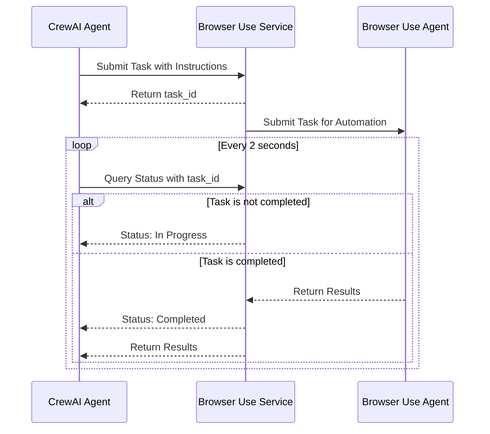

# crewai_tools_browser_use

## Overview
With the rise of Large Language Models (LLMs), AI agents are transforming productivity across various fields. Typically seen as standalone tools, these agents can achieve even more when working together. This repository explores the collaboration between two distinct agents: the [CrewAI](https://github.com/crewAIInc/crewAI) , which excels in generation and planning, and the [Browser Use](https://github.com/browser-use/browser-use), specialized in GUI-based automation tasks. By connecting their strengths, we can create a powerful synergy where one agent's capabilities complement the other's limitations. This initial trial demonstrates how heterogeneous agents can work together seamlessly, unlocking new possibilities for complex tasks that require both creativity and precision.

## 1. Browser Use Tool
BrowserUseTool (`browser_use_tool.py`) is a standard CrewAI toolk implementation. It can be placed in the `src/tools`. This tool receives an instruction and sends it to the browser-use agent. Since GUI automation tasks can take a fairly long time, it submits the task and performs rolling polling to check if the task has finished and produced results.


## 2. Browser Use Service
BrowserUseService (`browser_use_service.py`) is the backend component responsible for executing web automation task. The service can only work on one specific task at a time. If other tasks are submitted, they will be pending until the current task is finished. 



### Customization

You may need do some customization by yourself, to set up .env file, the browser configuration etc. The service default port is `4999`. Following is an example `.env` file of `browser_use_service.py`. Place them in the same folder. 
```
OPENAI_API_KEY=<YOUR_OPENAI_API_KEY>
MODEL_NAME=gpt-4o-mini
USERNAME=user
PASSWORD=password
```

Here, `USERNAME` and `PASSWORD` are sensitive_data will be passed to BrowserUse Agent.
```python
sensitive_data = {
    'x_name': os.environ['USERNAME'],
    'x_password': os.environ['PASSWORD']
}
```

### BrowserUse Installation

Please refer to the [Browser Use](https://github.com/browser-use/browser-use) page.

With pip (Python>=3.11):

```bash
pip install browser-use
```

install playwright:

```bash
playwright install
```


